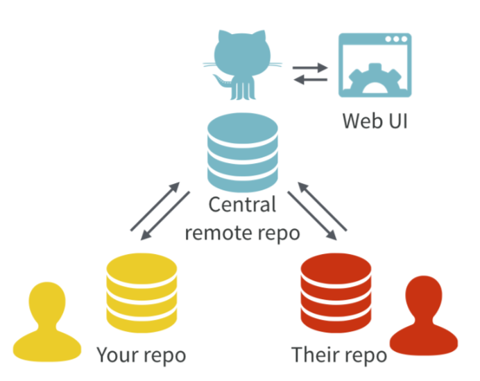

<style>
p.caption {
  font-size: 0.6em;
}
</style>

```{r setup, include=FALSE}
knitr::opts_chunk$set(echo = FALSE)
```


## Agradecimientos

- Este documento se basa en "Happy Git with R" de Jenny Bryan, los STAT 545 TAs, Jim Hester


https://happygitwithr.com


## Por qué hacer control de versiones de nuestros proyectos?

- Los proyectos suelen cambiar y crecer.
- Es difícil saber cuáles fueron todos los cambios a lo largo del tiempo (en especial tiempos largos, hazlo por tu yo del futuro!).
- Las colaboraciones se pueden complicar sin un buen control de versiones.

## Por qué hacer control de versiones de nuestros proyectos?

```{r, out.width = '40%'}
knitr::include_graphics('Figure10.png')
```

## Git

- Git es un sistema de control de versiones.
- Git funciona con GitHub, Bitbucket o GitLab
- Por qué usar Git en vez de solo renombrar los archivos? Por que es mejor tener una filogenia del archivo

```{r, out.width = '60%'}
knitr::include_graphics('Figure4.png')
```


## Versión de controles a mano

```{r, fig.cap="Excuse me, do you have a moment to talk about version control?, Jennifer Bryan, 2017", out.width = '50%'}
knitr::include_graphics('Figure5.png')
```

## Versión de control en Git

```{r, fig.cap="Excuse me, do you have a moment to talk about version control?, Jennifer Bryan, 2017", out.width = '80%'}
knitr::include_graphics('Figure1.png')
```

## Versión de control en Git

- Con Git cada contribuidor tiene una copia del repositorio central, con todos los archivos y la historia de los cambios por los que han pasado.

```{r, fig.cap="Excuse me, do you have a moment to talk about version control?, Jennifer Bryan, 2017", out.width = '60%'}

```

## GitHub

- GitHub es una plataforma que permite guardar código en forma de repositorios Git.


```{r, out.width = '80%'}
knitr::include_graphics('Figure8.png')
```


## Qué necesitamos para que esto funcione?

- Necesitamos Git en la computadora
- Necesitamos que Git en nuestra computadora le hable a GitHub (o el repositorio que quieran usar, pude ser GitLab, Bitbucket, etc).
- Luego necesitamos que R hable con este repositorio.


## Recomendaciones para sus proyectos

- Dedicar un directorio
- Es mejor organizarlo en un RStudio Project
- Hacer un repositorio de Git
- Trabajen como siempre, solo además de guardar, recuerden hacer commit
- De vez en vez hagan push de sus cambios cuando los hayan **verificado**.

## Proyectos colaborativos

- GitHub se parece más a un GoogleDoc que a un Word Document.
- Es fácil que los colaboradores hagan cambios y también es fácil saber quién hizo que.
- El owner del proyecto puede dar permisos a los diferentes colaboradores.
- También existen organizaciones, esto puede ser útil para manejar los permisos de grupos grandes de colaboración.

## Detalles especiales de GitHub

- Issues: Issue reports, es fácil saber de dónde vino un reporte y si se arregló.
- Pull requests: Los usuarios pueden solicitar contribuir y hacer cambios.

## R in GitHub

- La comunidad de R es muy activa en GitHub.
- Hay muchos paquetes ahí.
- Al ser parte de GitHub será más fácil que su código se utilice por la comunidad.
- GitHub y RStudio se conectan muy bien.
- Si R no es su lenguaje favorito, también se pueden beneficiar de usar Rstudio para manejar su repositorio.

## Ahora, a darle!

- Ya tenemos R y RStudio.
- Necesitamos una cuenta en GitHub, registren una si no tienen.
- Ahora vamos a: 
  - Revisar la instalación de Git
  - Familiarizarnos con GitHub
  - Conectarnos a GitHub

## Instalación de Git

- Como parte de los requerimientos les pedimos tener Git.
- Pueden revisar si todo está bien con el siguiente comando en su terminal:

```{bash eval=FALSE, echo=TRUE}
which git
git --version
```


- Si no lo tienen instalado:
- MAC: Usen Xcode.
- Linux: Usen apt-get o yum para instalar git
- Windows: [here](https://git-scm.com/book/en/v2/Getting-Started-Installing-Git)

## Ahora con GitHub!
- Hagan login y creen un repositorio nuevo
- Denle nombre: en mi caso use MiRepo
- Añadan una descripción: My mini repo
- Inicialicen el repositorio con un README
- Para lo demás usen los defaults
- Den Click en "Create repository"

## Traer el repositorio a nuestras compus
- Ya tenemos el repositorio en GitHub
- Para de verdad poderlo usar, lo tenemos que traer a nuestras computadoras, Clonenlo!
- Copien la liga en "Clone or download"

```{bash eval=FALSE, echo=TRUE}
which git
git clone https://mylink.com/you/your_repo
```

## Usemos el repositorio!

- Vamos a usar el repositorio como nuestro lugar de trabajo:

```{bash eval=FALSE, echo=TRUE}
cd myrepo
ls -la
head README.md
git remote show origin

```

- Qué nos dice este comando?

## Usemos el repositorio!

- Probemos haciendo un cambio en el README

```{bash eval=FALSE, echo=TRUE}
echo "Something I want to add to the README in my local computer" >> README.md
git status
```

- Qué pasó?

- Ahora tenemos que decirle a git que queremos seguir los cambios de ese archivo
- Vamos a *commit* los cambios y luego a subir (*push*) los mismos a GitHub

```{bash eval=FALSE, echo=TRUE}
git add README.md
git commit -m "A commit from my local computer"
git push
```

## Usemos el repositorio!

- Add es algo que se hace la primera vez que se usa un archivos. Con la opción -A se agregan todos los archivos de un folder.
- Piensen bien antes de hacer eso! a veces no queremos todos los archivos en un folder.
- Usen mensajes INFORMATIVOS en los commits, pude ser información muy útil en el futuro.
- Ahora verifica si los cambios se subieron a GitHub

## Credenciales en Git

- Algunas instalaciones de Git son muy listas y guardan el username y password, así que no lo tenemos que poner en cada push.
- Si por algo no está funcionando

Pueden seguir estos tutoriales para arreglarlo
https://happygitwithr.com/credential-caching.html

-Les recomiendo revisar cómo hacer conecciones con llaves ssh.
GitHub se mueve a establecerlo como standar
https://happygitwithr.com/ssh-keys.html

## Conectando Git y RStudio
- Hasta ahora todo lo de Git ha sido en línea de comando
- Pero RStudio nos puede ayudar con esto
- Para lograrlo, primero necesitamos que RStudio se conecte con Git
1. Crea un proyecto en RStudio desde un repositorio de Git.
File > New Project > Version Control > Git
2. En dónde vas a guardar ese repositorio?
3. Lo logramos! Git va a aparecer en la esquina superior derecha
4. Hagamos un cambio en el README

## Commit y push en RStudio
Desde RStudio:

- Da click en el “Git” tab el panel superior derecho.
- Haz click en “Staged” para README.md.
- Da click en “Commit”.
- Escribe un mensaje útil en “Commit message”.
- Click “Commit”.
- Click "push"

## Rmarkdown

- Son archivos con extensión .Rmd 
- Nos permiten documentar de forma sencilla nuestro código

```{r, out.width = '60%'}
knitr::include_graphics('Figure9.png')
```


## Rmarkdown en GitHub

- Creemos un Rmakrdown y subámoslo a GitHub
- Ahora hay que agregarlo al repositorio (add), stage and commit.
- Subieron el hmlt? Qué tal se ve?
- No se ve como queremos, verdad? Para eso necesitamos recuperar el .md. El .md es un resultado intermedio de crear el html desde Rmd.
- Tenemos que cambiar el header para esto

```{r echo=TRUE, eval=FALSE}
---
title: "RmarkwondTest"
output: 
  html_document:
    keep_md: true
---
```

## Si les gustó Rmarkdown

```{r, out.width = '100%'}
knitr::include_graphics('Figure11.jpg')
```


## Git basics: commands

- Qué pasó?
- Qué hacemos ahora?
- Ahora ya tienes todo para subir tus cosas a GitHub y documentarlas bonito!

## Git basics: Repository, diff

- Un repository o repo es un grupo de archivos manejado por Git
```{r, fig.cap="https://happygitwithr.com/git-basics.html", out.width = '60%'}
knitr::include_graphics('Figure2.png')
```

## Git basics: commands
- Clone
```{bash eval=FALSE, echo=TRUE}
git clone https://repor.com
```

- Agregar un archivo al repo (solo una vez) y hacer commit
```{bash eval=FALSE, echo=TRUE}
git add newfile.R
git commit -m "mensaje informativo" newfile.R
```
## Git basics: commands

- Qué pasó?
```{bash eval=FALSE, echo=TRUE}
git status
git log
git log --oneline
```

- Comparar versiones
```{bash eval=FALSE, echo=TRUE}
git diff
git diff myfile.R
```
## Git basics: commands

- Push
```{bash eval=FALSE, echo=TRUE}
git push
```

- Pull y pull evitando conflictos de merge (Fusión!)
```{bash eval=FALSE, echo=TRUE}
git pull
git pull --ff-only
```

## Git basics: commands

- Fetch Commits
```{bash eval=FALSE, echo=TRUE}
git fetch
```

- Create and Switch to a branch
```{bash eval=FALSE, echo=TRUE}
git branch [branch-name]
git checkout [branch-name]
```

## Merge conflics
- A veces, no tan a veces también, las cosas no salen bien a la primera
- Merging (Fusionar) es una de esas cosas
- Cuando bajamos un cambio o fusionamos branches esto puede pasar.
- Primera regla: NO ENTRAR EN PANICO!!!
- Revisen el status del repositorio. Qué archivo tiene conflicto?

## Merge conflics

- Abran ese archivo y busquen los problemas de merge. Es fácil, se ven así:

```{r echo=TRUE, eval=FALSE}
<<<<<<< HEAD:index.html
<div id="footer">contact : email.support@github.com</div>
=======
<div id="footer">
 please contact us at support@github.com
</div>
>>>>>>> issue-5:index.html
```

- Editen esa sección, dejen una versión final.
- Hagan commit y push
- Si entran en pánico? Aborten la misión! 

```{bash eval=FALSE, echo=TRUE}
git merge --abort t
```

## En resumen

```{r, fig.cap="https://xkcd.com", out.width = '40%'}
knitr::include_graphics('Figure3.png')
```
